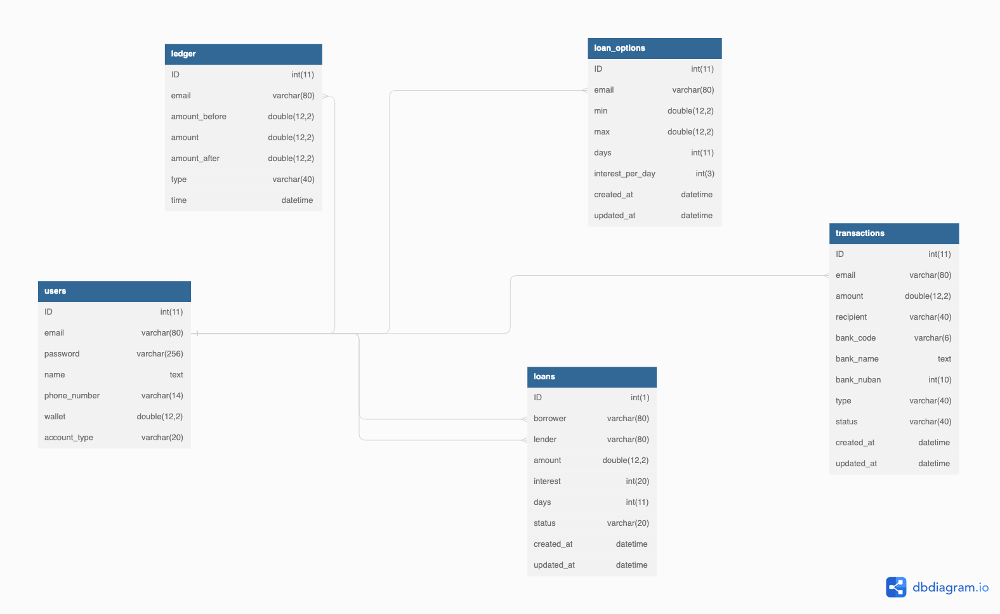

# Lendsqr Demo Credit
Demo Credit is a mobile lending backend system with a wallet functionality

#
## ⚡️ Features
* User registration
* User login
* Ledger for accurate book keeping
* Internal transfer between users
* Withdrawal
* Deposit (Account topup)
* Creating loans (For lenders)
* Accepting loan offers (For borrowers)
* Loan Repayment with interest using formula `amount(percent / 100) * days)`
* Unit testing

#
## 🔥 Technologies
* Typescript
* Mysql
* KnexORM
* Jest

#
## 🥷 Installation

This repository was written in typescript and runs on Nodejs

1. Make sure you're running Node.js on your system
2. ``git clone https://github.com/SilverC0de/lendsqr-demo-credit.git``
3. ``cd lendsqr-demo-credit``
4. ``npm i``
5. ``npm build``
6. ``npm run it``

#
## 🚀 Testing

1. Download the postman documentation here 
2. Open Postman and import the collection
3. Add the variable `baseUrl` with value `https://dshj` to the collection and save
4. Navigate the collection and test the endpoints

#
## 📚 Database Schema
MySQL Database Schema design using InnoDB storage engine. It has foreign keys linking the users and other tables.

* **users**: The `users` table keeps the data of all users (borrowers and lenders)
* **ledger**: The `ledger` is the book keeping system that keeps track of all the debits and credits of each user so it has to be linked to the `users table`
* **loan_options**: The `loan_options` is the table collating loans created by lenders, so it has to be linked to the `users` table for each lender
* **loans**: The `loans` table collates data of loans that have been accepted by borrowers
* **transactions**: The `transactions` table collates data of all types of transactions for every user

